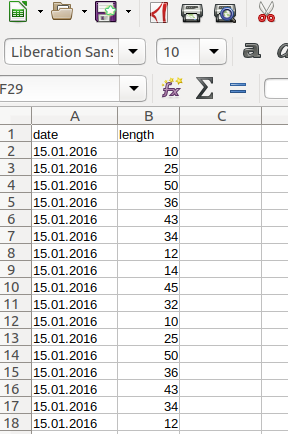
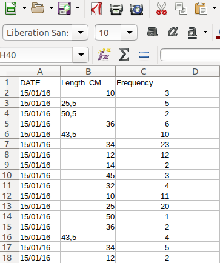
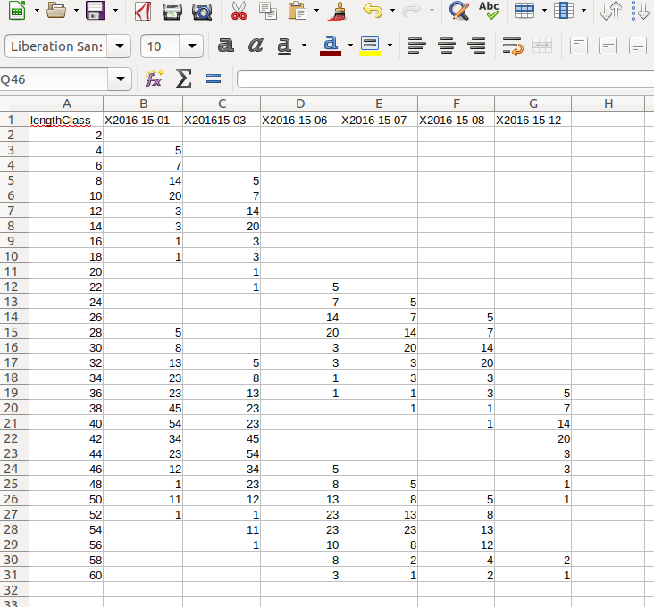

```{r ReaddataLoadLibraries, message=FALSE, include=FALSE, echo=FALSE}
knitr::opts_chunk$set(echo = TRUE,
                      cache = FALSE,
                      warning = FALSE,
                      eval = TRUE,
                      error = FALSE,
                      warning = FALSE,
                      message = FALSE,
                      include = TRUE,
                      collapse = TRUE,
                      comment = "#>",
                      fig.show = "hold",
                      fig.width=8, fig.height=7)
```


#*Background*
Length-frequency data (LFQ) is collected by measuring the length of focal fish species onboard of the fishing vessel, the landing site or the fish market. Concerning fish there are three different lengths which can be measured: standard length (SL), fork length (FL), and total length (TL), for more information see [**here**](http://www.fao.org/docrep/003/T0535E/T0535E02.htm#ch2). The big advantage of LFQ data is that only a representative subsample of the total catch is needed, meaning that not every fish in the catch has to be measured if the subsample is random but representative. The sample should be representative of the whole stock under investigation and for all seasons of a year. Furthermore, enough samples of a range of different fish lengths have to be measured in order for the methods of **`TropFishR`** to work - a reference value is around 50 fish measurements per month. Assuming that collected data are entered in some spreadsheet or text format, this document will illustrate how different arrangements of data can be read into R and converted to the LFQ list required by all methods within **`TropFishR`**. No manual data input in R is required, The data used in the examples below were generated randomly.


#*LFQ import*
There are three main ways in which you can arrange your data in a spreadsheet or text file and easily import it into R an convert it to a LFQ list (Fig. 1-3). Each of these 3 methods works evenly well with a 'csv', 'xls', or 'txt' file. For simplification, I will present all three methods with 'csv' files and consequently demonstrate how to use a 'xlsx' and a 'txt' file. This vignette requires to load the **`TropFishR package`**, ` require(TropFishR)`.


##*Data arrangement 1*
The first data arrangement assumes that each measurement was inserted into a specific cell in the spreadsheet, together with associated date when this measurement was done.





The data in this arrangement can be loaded into R by following code.

```{r eval=FALSE, echo = TRUE}
lfq1 <- read.csv2("lfq1.csv")

lfq1$date <- as.Date(lfq1$date, format = "%d.%m.%Y")

lfq1new <- lfqCreate(data = lfq1, Lname = "length", Dname = "date")

plot(lfq1new, Fname = "catch")
```

It is awlays important to convert the date information into the R class 'Date' which can be done by the function `as.Date()`. The second argument in that function displays the format of the date in your data, '%d' stand for the day, '%m' for the month, and '%Y' for the year with the century, e.g. 2014, without the century it would be '%y', e.g. 14. The separator, here '.', should be the same as in your data (see other examples below). The function `lfqCreate()` is a handy function, which allows you to convert the dataframe into a list in the right format. The arguments 'Lname' and 'Dname' define the names of the columns in your dataframe with the length measurements and the dates, respectively. They should correspond to `colnames(lfq1)`. Besides the arguments above it allows for many other adjustments, such as setting the bin size or aggregating the data monthly, see `?lfqCreate` for more information.


##*Data arrangement 2*
The second data arrangement represents the case with an additional column which contains the number of times the length was measured at respective date.




Data of this arrangement can be loaded into R by following code.

```{r eval=FALSE, echo = TRUE}
lfq2 <- read.csv2("lfq2.csv")

lfq2$date <- as.Date(lfq2$date, format = "%d/%m/%y")

lfq2new <- lfqCreate(data = lfq2, Lname = "Length_CM", Dname = "DATE", Fname = "Frequency")

plot(lfq2new, Fname = "catch")
```
Be aware of the different date format, the different column headers or names and the additional argument in the function `lfqCreate()` called 'Fname' displaying the name of the column with the frequency information.


##*Data arrangement 3*
The last data arragement presented here, assumes that the data was already sorted into length classes within your spreadsheet. The first column does now represent the length classes and the number of times each length class was observed at repsective sampling times is in the subsequent columns, where each column represent one sampling time (here aggregated per month). In this example, the information about the date is contained within the header of the not-length-class columns (cp Fig. 3). This is however not necessary and the date information can also be added manually in R.



Data in this arrangement have to be treated a little differently:

```{r eval=FALSE, echo = TRUE}
lfq3 <- read.csv2("lfq3.csv")

dates <- colnames(lfq3)[-1]
dates <- strsplit(dates, "X")
dates <- unlist(lapply(dates, function(x) x[2]))
dates <- as.Date(dates, "%Y-%d-%m")

lfq3new <- list(dates = dates,
                midLengths = lfq3$lengthClass,
                catch = as.matrix(lfq3[,-1]))
class(lfq3new) <- "lfq"
lfq3new$catch[is.na(lfq3new$catch)] <- 0

plot(lfq3new, Fname = "catch")
```
In this case, the function `lfqCreate()` can not be used, instead the data is arranged into a list manually. Extracting the dates involves extra steps to separate the actual dates from the 'X'. Next, the dates, mid lengths and the catch matrix can be directly arranged together with the function `list()`. It is of crucial importance to use the exact names and spelling (incl. case sensitivity) in the list ('dates', 'midLengths', 'catch'). with the function `class()` the TropFishR internal class 'lfq' can be assigned to the created list. Missing values in the catch matrix (`NA`, `NaN`) should be put to 0.


##*Other file formats*
Of course, your data has not to be in the csv format, it can just as well be 'odt', 'xls', 'xlsx', 'txt' or any text file. Other formats require different functions to load the data into R (beside `read.csv2()`). The following code demonstrats this for a 'xlsx' and 'txt' file.


```{r echo=TRUE, eval=FALSE}
lfq2a <- read.table("lfq2.txt", sep="\t", dec=',', fileEncoding="latin1", skipNul=TRUE)

install.packages("openxlsx")
require(openxlsx)
lfq3a <- read.xlsx("lfq3.xlsx", sheet = 1)

```

The function `read.table()` allows to read and load many different file formats into R, The arguments 'sep' and 'dec' control the separator between columns (here tabstop) and the decimal separator (here comma), respectively. Additional arguments like 'fileEncoding' and 'skipNul' might be necessary to use for controlling the encoding of the file and if nuls should be skipped. More information about the arguments can be viewed with `?read.table`. There are many different R packages available to read 'xls' and 'xlsx' files into R, one of the fastest is openxlsx, but it does not allow to read in 'xls' files. For this you might consider using the package 'xlsx'. These functions allow you to read in any sheet of your 'xlsx' file by using the 'sheet' argument.


#*Conclusion*
This vignette demonstrates the first step in the application of **`TropFishR`**, the arrangement of your length measurements in a spreadsheet (or text file) and the import into R. Nevertheless, this step is important and several requests motivated me to write this vignette. How you can use **`TropFishR`** for the further analysis of your data is demonstrated in the detailed [**tutorial**](https://rawgit.com/tokami/TropFishR/master/inst/doc/tutorial.html).


#*Author's comment*
I hope this short vignette is of help. Any comment or question can be addresed to me via [**email**](mailto:t.k.mildenberger@gmail.com) or you can post an issue at [**GitHub**](https://github.com/tokami/TropFishR/issues). You can follow the development of **`TropFishR`** on [**ResearchGate**](https://www.researchgate.net/project/TropFishR?_esc=homefeed&_viewIds%5B0%5D=hVPmo2RDCok60qGq2z0JOroN&_viewIds%5B1%5D=zyj0j6jnUgNvrPXMrG9rouAP). All bold words are links.
